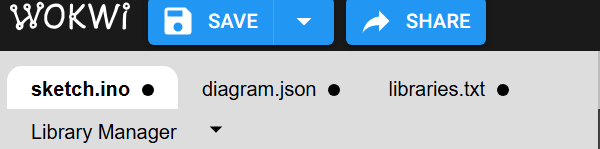
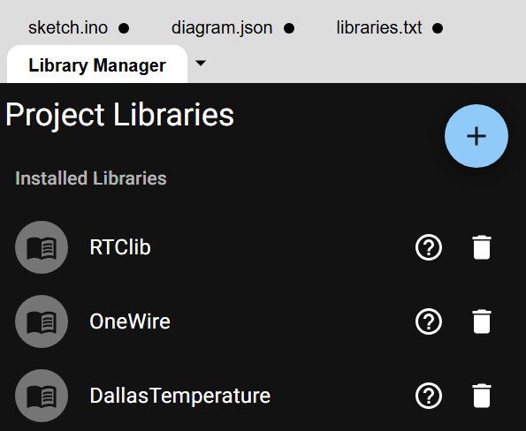
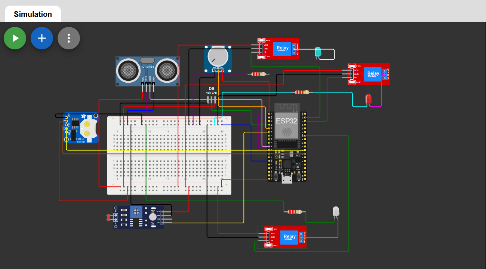
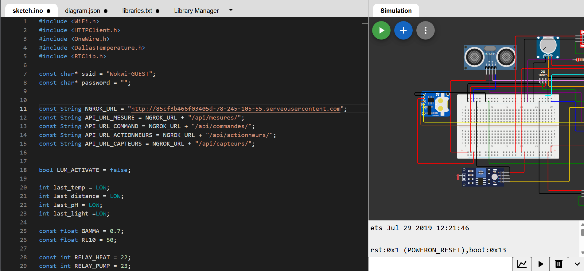

# 🐠 Smart Aquarium - Système de Monitoring IoT

Système de surveillance intelligent pour aquarium avec interface web, API REST et gestion de capteurs/actionneurs en temps réel.


---

## 📋 Table des matières

- [Vue d'ensemble](#-vue-densemble)
- [Architecture](#-architecture)
- [Prérequis](#-prérequis)
- [Installation](#-installation)
- [Démarrage rapide](#-démarrage-rapide)
- [Configuration](#-configuration)
- [Utilisation](#-utilisation)
- [API Documentation](#-api-documentation)
- [Développement](#-développement)
- [Troubleshooting](#-troubleshooting)

---

## 🎯 Vue d'ensemble

**Smart Aquarium** est une solution complète de monitoring d'aquarium permettant de :

- 📊 Surveiller les paramètres de l'eau en temps réel (température, pH, etc.)
- ⚙️ Contrôler des actionneurs (pompes, éclairage, nourrisseur)
- 🚨 Recevoir des alertes en cas de dépassement de seuils
- 📈 Visualiser l'historique des mesures
- 🔄 Automatiser la gestion de l'aquarium

### Fonctionnalités principales

- ✅ Interface web moderne et responsive
- ✅ API REST complète (FastAPI)
- ✅ Gestion multi-capteurs (DS18B20, pH, etc.)
- ✅ Contrôle d'actionneurs en temps réel
- ✅ Système d'alertes configurable
- ✅ Historique des mesures avec graphiques
- ✅ Architecture microservices avec Docker

---

## 🏗️ Architecture

```
┌─────────────────────────────────────────────────────────┐
│                   SMART AQUARIUM                        │
└─────────────────────────────────────────────────────────┘
                            │
        ┌───────────────────┼───────────────────┐
        │                   │                   │
   ┌────▼────┐         ┌────▼────┐        ┌────▼────┐
   │ Frontend│         │ Backend │        │Database │
   │ Django  │◄────────┤ FastAPI │◄───────┤PostgreSQL│
   │  :3000  │         │  :8000  │        │  :5432  │
   └─────────┘         └─────────┘        └─────────┘
        │                   │
        │              ┌────▼────┐
        │              │ Capteurs│
        │              │   IoT   │
        └──────────────►ESP32/RPi│
                       └─────────┘
```

### Stack technique

**Frontend (Django)**
- Framework : Django 5.2
- Templates : HTML/CSS/JavaScript
- Port : 3000
- Fonctionnalités : Dashboard, Gestion des capteurs, Profil utilisateur

**Backend (FastAPI)**
- Framework : FastAPI
- Base de données : PostgreSQL 15
- ORM : SQLAlchemy
- Port : 8000
- Fonctionnalités : API REST, Gestion des données, Logique métier

**Infrastructure**
- Conteneurisation : Docker & Docker Compose
- Base de données : PostgreSQL 15 Alpine
- Réseau : Bridge Docker interne

---

## ⚙️ Prérequis

### Logiciels requis

- **Docker** (version 20.10+)
- **Docker Compose** (version 2.0+)
- **Git**
- **WSL2** (si sous Windows)

### Vérifier l'installation

```bash
docker --version
docker compose version
git --version
```

---

## 📦 Installation

### 1. Cloner le projet

```bash
git clone https://github.com/FredLuc12/smartaquarium.git
cd smartaquarium
```

### 2. Structure du projet

```
smartaquarium/
├── backend/              # API FastAPI
│   ├── app/
│   │   ├── models/       # Modèles SQLAlchemy
│   │   ├── routes/       # Endpoints API
│   │   ├── services/     # Logique métier
│   │   └── main.py       # Point d'entrée
│   └── requirements.txt
├── frontend/             # Interface Django
│   ├── dashboard/        # App principale
│   │   ├── templates/    # Templates HTML
│   │   ├── views.py      # Vues Django
│   │   └── urls.py
│   ├── manage.py
│   └── requirements.txt
├── docker-compose.yml    # Configuration Docker
└── README.md
```

### 3. Configuration des variables d'environnement

Créer un fichier `.env` à la racine :

```env
# Database
POSTGRES_DB=smartaquarium
POSTGRES_USER=aquarium_user
POSTGRES_PASSWORD=votre_mot_de_passe_secure

# Django
DJANGO_SECRET_KEY=votre_secret_key_django
DEBUG=True

# FastAPI
API_HOST=0.0.0.0
API_PORT=8000
```

---

## 🚀 Démarrage rapide

### 1. Lancer les conteneurs Docker

```bash
# Construire et démarrer tous les services
docker compose up -d --build
```

Cette commande démarre :
- **smartaquarium-db** : Base de données PostgreSQL
- **smartaquarium-api** : Backend FastAPI
- **smartaquarium-frontend** : Frontend Django

### 2. Vérifier que tout fonctionne

```bash
# Afficher les conteneurs en cours d'exécution
docker ps
```

Vous devriez voir 3 conteneurs actifs :

| CONTAINER ID | IMAGE                  | PORTS                    | NAMES                    |
|-------------|------------------------|--------------------------|--------------------------|
| xxxxx       | smartaquarium-frontend | 0.0.0.0:3000->8080/tcp   | smartaquarium-frontend   |
| xxxxx       | smartaquarium-api      | 0.0.0.0:8000->8000/tcp   | smartaquarium-api        |
| xxxxx       | postgres:15-alpine     | 0.0.0.0:5432->5432/tcp   | smartaquarium-db         |

### 3. Créer un superutilisateur Django

```bash
# Créer un compte admin
docker exec -it smartaquarium-frontend python manage.py createsuperuser
```

Remplir les informations :
- **Username** : `admin`
- **Email** : `admin@example.com`
- **Password** : (votre mot de passe)

### 4. Accéder à l'application

🌐 **Interface Web** : [http://localhost:3000](http://localhost:3000)

📚 **Documentation API** : [http://localhost:8000/docs](http://localhost:8000/docs)

---

## 🔧 Configuration

### Configuration des capteurs

Les capteurs se configurent via l'API. Exemple avec cURL :

```bash
# Créer un capteur de température
curl -X POST "http://localhost:8000/api/capteurs/" \
  -H "Content-Type: application/json" \
  -d '{
    "nom": "Température Eau",
    "type": "DS18B20",
    "unite": "°C",
    "localisation": "Bassin principal",
    "seuil_min": 22.0,
    "seuil_max": 28.0,
    "actif": true
  }'
```

### Configuration des actionneurs

```bash
# Créer un actionneur pompe
curl -X POST "http://localhost:8000/api/actionneurs/" \
  -H "Content-Type: application/json" \
  -d '{
    "nom": "Pompe principale",
    "type_actionneur": "pompe",
    "etat_actuel": true
  }'
```

### Envoyer une mesure

```bash
# Enregistrer une mesure de température
curl -X POST "http://localhost:8000/api/mesures/" \
  -H "Content-Type: application/json" \
  -d '{
    "capteur_id": 1,
    "valeur": 24.5,
    "horodatage": "2026-01-28T22:00:00"
  }'
```

---

## 💻 Utilisation

### Dashboard principal

Accédez au tableau de bord : [http://localhost:3000/dashboard/](http://localhost:3000/dashboard/)

**Fonctionnalités :**
- 🚨 Visualisation des alertes actives
- ⚙️ Contrôle des actionneurs (ON/OFF)
- 📊 Affichage des capteurs actifs

### Page Capteurs

Accédez à : [http://localhost:3000/capteurs/](http://localhost:3000/capteurs/)

**Fonctionnalités :**
- 📋 Liste de tous les capteurs
- 🔍 Détails d'un capteur (clic sur une ligne)
- 📈 Mini-graphique d'évolution
- 📜 Historique complet des mesures (popup)

### Page Paramètres

Accédez à : [http://localhost:3000/settings/](http://localhost:3000/settings/)

**Fonctionnalités :**
- 📊 Statistiques en temps réel
- 📈 Graphique d'évolution de la température
- 🧪 Tests et simulations d'actionneurs

### Profil utilisateur

Accédez à : [http://localhost:3000/profile/](http://localhost:3000/profile/)

**Fonctionnalités :**
- ✏️ Modifier les informations personnelles
- 📅 Voir les informations du compte

---

## 📚 API Documentation

### Accès à la documentation interactive

🔗 **Swagger UI** : [http://localhost:8000/docs](http://localhost:8000/docs)

### Endpoints principaux

#### 🔵 Capteurs

| Méthode | Endpoint | Description |
|---------|----------|-------------|
| `GET` | `/api/capteurs/` | Liste tous les capteurs |
| `POST` | `/api/capteurs/` | Créer un capteur |
| `GET` | `/api/capteurs/{id}` | Détails d'un capteur |
| `PUT` | `/api/capteurs/{id}` | Modifier un capteur |
| `DELETE` | `/api/capteurs/{id}` | Supprimer un capteur |

#### 📊 Mesures

| Méthode | Endpoint | Description |
|---------|----------|-------------|
| `GET` | `/api/mesures/` | Liste toutes les mesures |
| `POST` | `/api/mesures/` | Enregistrer une mesure |
| `GET` | `/api/mesures/capteur/{id}` | Mesures d'un capteur |
| `GET` | `/api/mesures/capteur/{id}/latest` | Dernière mesure d'un capteur |

#### ⚙️ Actionneurs

| Méthode | Endpoint | Description |
|---------|----------|-------------|
| `GET` | `/api/actionneurs/` | Liste tous les actionneurs |
| `POST` | `/api/actionneurs/` | Créer un actionneur |
| `GET` | `/api/actionneurs/{id}` | Détails d'un actionneur |
| `PUT` | `/api/actionneurs/{id}` | Modifier l'état d'un actionneur |

#### 🚨 Alertes

| Méthode | Endpoint | Description |
|---------|----------|-------------|
| `GET` | `/api/alertes/` | Liste toutes les alertes |
| `POST` | `/api/alertes/` | Créer une alerte |
| `GET` | `/api/alertes/active` | Alertes actives uniquement |
| `PUT` | `/api/alertes/{id}/acquitter` | Acquitter une alerte |
| `PUT` | `/api/alertes/{id}/resoudre` | Résoudre une alerte |

---

## 🛠️ Développement

### Commandes Docker utiles

```bash
# Voir les logs en temps réel
docker compose logs -f

# Voir les logs d'un service spécifique
docker compose logs -f frontend
docker compose logs -f api

# Redémarrer un service
docker compose restart frontend

# Arrêter tous les services
docker compose down

# Arrêter et supprimer les volumes
docker compose down -v

# Reconstruire les images
docker compose build --no-cache
```

### Accéder à un conteneur

```bash
# Shell dans le conteneur frontend
docker exec -it smartaquarium-frontend bash

# Shell dans le conteneur API
docker exec -it smartaquarium-api bash

# Accès PostgreSQL
docker exec -it smartaquarium-db psql -U aquarium_user -d smartaquarium
```

### Appliquer les migrations Django

```bash
docker exec -it smartaquarium-frontend python manage.py makemigrations
docker exec -it smartaquarium-frontend python manage.py migrate
```

### Tests

```bash
# Tests Django
docker exec -it smartaquarium-frontend python manage.py test

# Tests FastAPI (si configurés)
docker exec -it smartaquarium-api pytest
```

---

## 🔍 Troubleshooting

### Problème : Les conteneurs ne démarrent pas

**Solution :**
```bash
# Vérifier les logs
docker compose logs

# Vérifier que les ports ne sont pas déjà utilisés
netstat -tuln | grep -E '3000|8000|5432'

# Supprimer et recréer
docker compose down -v
docker compose up -d --build
```

### Problème : API non accessible depuis le frontend

**Cause :** Conflit entre URL Docker et URL navigateur

**Solution :**
- Dans `views.py` (Python) : utiliser `http://smartaquarium-api:8000`
- Dans les templates (JavaScript) : utiliser `http://localhost:8000`

### Problème : Base de données ne se connecte pas

```bash
# Vérifier que PostgreSQL est bien démarré
docker compose ps

# Voir les logs de la DB
docker compose logs db

# Tester la connexion
docker exec -it smartaquarium-db psql -U aquarium_user -d smartaquarium -c "SELECT 1;"
```

### Problème : "ModuleNotFoundError"

```bash
# Réinstaller les dépendances
docker exec -it smartaquarium-frontend pip install -r requirements.txt
docker exec -it smartaquarium-api pip install -r requirements.txt

# Ou reconstruire l'image
docker compose build --no-cache frontend
```

### Problème : Permissions sous WSL2

```bash
# Changer les permissions
sudo chown -R $USER:$USER .
```

---

## 📝 Notes importantes

### Sécurité

⚠️ **En production :**
- Changer tous les mots de passe par défaut
- Utiliser des secrets Docker
- Activer HTTPS
- Mettre `DEBUG=False` dans Django
- Configurer un reverse proxy (Nginx)

### Performance

- Le frontend se rafraîchit automatiquement toutes les 30 secondes
- Les graphiques affichent les 10-50 dernières mesures
- Pensez à purger régulièrement les anciennes mesures

### Accès distant

Pour exposer l'API publiquement, utilisez un tunnel SSH :

```bash
ssh -R 80:localhost:8000 serveo.net
```
### Configuration de Wokwi 
#### Configuration des connexions entre les différents composants

```bash
# Ajoutez un fichier diagram.json dans l'outil Wokwi
```


#### Installations des différents packages


#### Simulation du circuit éléctrique


#### Visualisation général depuis l'outil
```bash
# Mise en place du code arduino dans la partie sketch.ino
```

